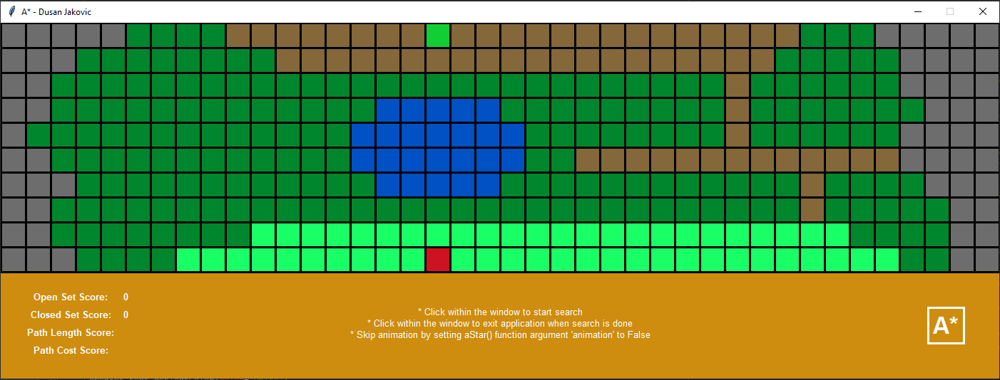

# A* algorithm

A-star algorithm for path finding in 2D space

## Getting Started

These instructions will get you a copy of the project up and running on your local machine for development and testing purposes. See deployment for notes on how to deploy the project on a live system.


### Installing

Python

```
Install Python (v.3)
```

Library

```
Install "graphics.py", written by John Zelle
```

## Run

A*
```
Run A* algortihm with fixed cell cost of "1": aStar1.py
Run A* algortihm with diverse cell cost: aStar2.py
```

Dijkstra and Breath First Search
```
Comment out parts of code to change the search algortihm. Explained in the code..
```

Boards
```
Change "filepath" to test other boards attaqched in the "bards" directory.
```

## Screens

aStar2.py

```

```


## Authors

* **Dusan Jakovic** - *Initial work* - [PurpleBooth](https://github.com/PurpleBooth)
